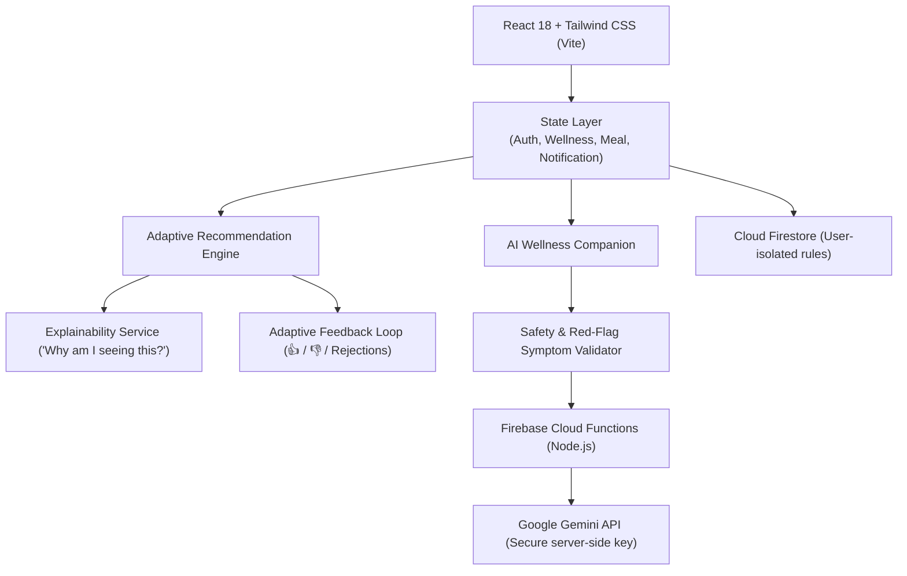
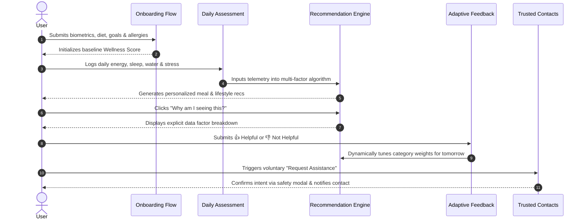

# IntelWell

> **Smart Personalized Nutrition and Wellness Recommendation Application**

IntelWell is an AI-oriented, full-stack, production-grade wellness recommendation platform designed to provide personalized nutrition and lifestyle guidance based on user profiles, biometric metrics, wellness goals, daily assessments, dietary preferences, and continuous user feedback.

---

## 1. Project Overview

Modern lifestyle medicine demonstrates that generic diet templates and rigid calorie-counting apps fail to generate long-term habit adherence. Human biology fluctuates daily based on sleep debt, hydration, perceived stress, and physical exertion.

**IntelWell** bridges the gap between biological telemetry and everyday decisions. It generates daily nutrition and wellness suggestions accompanied by transparent, plain-English explanations (**"Why am I seeing this?"**) and an adaptive feedback loop that learns from user ratings, preferences, and ingredient rejections.

---

## 2. Problem Statement

* **Generic Advice**: Traditional apps treat all users identically, providing rigid plans that ignore daily fluctuations in stress, fatigue, or hydration.
* **Opaque Algorithms**: Users receive recommendations without understanding why an action was suggested, breeding skepticism and quick abandonment.
* **No Closed Feedback Loop**: When users dislike an ingredient or find an action unrealistic, standard apps fail to adapt future suggestions.
* **Medical Overreach vs. Safety**: Many digital health apps either blur the boundary into unauthorized medical practice or lack emergency safety protocols.

---

## 3. Proposed Solution

IntelWell introduces an **Explainable, Adaptive Wellness Engine**:
1. **Multi-Factor Synthesis**: Integrates baseline biometrics (BMI, BMR, water targets), dietary restrictions, strict allergen filters, and 60-second daily check-ins.
2. **Explainable AI**: The signature **"Why am I seeing this?"** feature provides a clear data breakdown of the exact triggers (e.g. hydration deficit, sleep debt, goal match) behind every recommendation.
3. **Adaptive Feedback Loop**: Every recommendation supports 👍 Helpful, 👎 Not Helpful, and specific rejection reasons (e.g., "Dislike ingredient", "Too difficult") which dynamically tune future recommendation weights.
4. **Strict Ethical Safety Guardrails**: Non-diagnostic disclaimers, real-time red-flag symptom interception (911/988 crisis hotlines), and a user-controlled trusted contact feature.

---

## 4. Key Features

* **Personalized User Profiles**: Biometric tracking (Height, Weight, BMI, BMR), dietary preferences, and strict allergen exclusions.
* **Dynamic Wellness Score**: Transparent 0–100 composite index calculated across 5 measurable lifestyle pillars (Hydration 20%, Sleep 25%, Movement 20%, Nutrition 20%, Consistency 15%).
* **Daily Wellness Assessment**: 60-second check-in for energy (1-10), mood, sleep duration/quality, water, activity, and subjective reflections.
* **Adaptive Meal Planner**: Curated Breakfast, Lunch, Dinner, and Healthy Snacks with exact macros, prep times, allergen safety badges, and 1-click "Swap Meal".
* **Smart Grocery List**: Automatic ingredient aggregation from meal plans, grouped by supermarket department (Produce, Protein, Pantry, Dairy/Plant Alternatives, Seasonings).
* **AI Wellness Companion**: Context-aware conversational assistant with strict non-diagnostic guardrails and preset prompts.
* **Wellness Analytics & Trends**: Interactive SVG trajectory charts comparing 7-day and 30-day score trends, water intake vs target, and sleep patterns.
* **Weekly AI Summary**: Executive 7-day recap highlighting positive habits formed, areas needing attention, and next week's focus plan.
* **Trusted Contact Assistance**: User-controlled directory with safety-confirmed check-in notification dispatching.
* **Notifications & History**: In-app reminder drawer and complete historical audit logs for assessments and recommendation feedback.

---

## 5. Unique Features

1. **"Why Am I Seeing This?" Modal**: Demystifies recommendation logic by showing exact weighted data factors and adaptive learning influence.
2. **Dual-Mode Engine (Instant Evaluation + Cloud Ready)**: Allows frictionless evaluation through 3 pre-built realistic personas (**Sarah Chen**, **Alex Rivera**, **Morgan Taylor**) without needing immediate cloud credentials, while being 100% production-ready for Firebase.
3. **Real-Time Red-Flag Interception**: Assessment notes and AI assistant queries are scanned for acute medical symptoms (e.g., chest pain, shortness of breath, severe depression), immediately triggering crisis hotline resources.

---

## 6. System Architecture



---

## 7. Technology Stack

### Frontend
* **Core**: React 18+, Vite
* **Styling**: Tailwind CSS (Tailwind v4 with `@tailwindcss/vite`), Custom Emerald/Teal Design System
* **Icons**: Lucide React
* **Micro-interactions**: Canvas Confetti

### Cloud & Backend
* **Authentication**: Firebase Authentication
* **Database**: Cloud Firestore
* **Serverless Backend**: Firebase Cloud Functions (TypeScript / Node.js)
* **Hosting**: Firebase Hosting (`firebase.json`)

### AI & Data Engine
* **AI Abstraction**: Pluggable `IAIEngine` interface (Gemini 1.5 Flash / Cloud Function proxy / deterministic heuristic fallback)
* **Testing**: Vitest automated unit test runner

---

## 8. Application Workflow



---

## 9. Security & Privacy

* **Zero Frontend Key Leaks**: Secret API keys (Gemini API, Firebase Admin) are strictly isolated in server-side environment variables (`GEMINI_API_KEY`) and never bundled in client code.
* **Strict Firestore Security Rules**: All user collections (`healthProfiles`, `dailyAssessments`, `recommendations`, `groceryLists`) are restricted to `request.auth.uid == userId`. Unauthenticated reads and writes are rejected.
* **User Data Portability**: Full JSON data export feature available directly from the User Profile.

---

## 10. Screenshots

| Personalized Dashboard | "Why Am I Seeing This?" Explainability |
|:---:|:---:|
| *(Dashboard screenshot)* | *(Explainability modal screenshot)* |

| Adaptive Meal Planner | Smart Grocery List |
|:---:|:---:|
| *(Meal planner screenshot)* | *(Grocery list screenshot)* |

---

## 11. Installation & Running Locally

### Prerequisites
* Node.js v18+ or v20+
* npm v9+

### 1. Clone & Install
```bash
git clone https://github.com/your-username/intelwell.git
cd intelwell
npm install
```

### 2. Environment Configuration (Optional for Cloud Mode)
To connect your own Firebase Cloud project, create a `.env` file:
```bash
cp .env.example .env
```
Populate the Firebase configuration variables from your Firebase Console. If `.env` is omitted, IntelWell seamlessly operates in **Local Evaluation Mode** with pre-seeded demo personas.

### 3. Run Development Server
```bash
npm run dev
```
Open [http://localhost:5173](http://localhost:5173) in your browser.

### 4. Run Automated Tests
```bash
npm test
```
Executes the Vitest test suite covering:
* Score calculation bounds and factor weights
* Strict allergen exclusion and dietary filtering
* Emergency red-flag symptom detection and non-diagnostic disclaimers

### 5. Build for Production
```bash
npm run build
```

---

## 12. Deployment

### Firebase Hosting & Functions
1. Install Firebase CLI: `npm install -g firebase-tools`
2. Authenticate: `firebase login`
3. Initialize project: `firebase use --add <your-project-id>`
4. Deploy Hosting & Firestore Rules:
   ```bash
   npm run build
   firebase deploy --only hosting,firestore:rules
   ```
5. Deploy Cloud Functions:
   ```bash
   cd functions
   npm install
   npm run build
   firebase deploy --only functions
   ```

---

## 13. Future Enhancements

* **Mobile App (React Native / Flutter)**: Seamlessly connect the existing Firestore backend and Cloud Functions to native iOS and Android apps.
* **Wearable Health Integration**: Continuous telemetry sync with Apple HealthKit, Google Health Connect, and Whoop for passive sleep and HRV capture.
* **Computer Vision Meal Logging**: Photographing a meal to automatically extract estimated macros and ingredient tags.
* **Multi-Language Localization**: Internationalized UI and regional localized grocery item catalogs.

---

## 14. Academic & Engineering Relevance

IntelWell was designed to demonstrate advanced principles of:
* **Explainable AI (XAI)** in digital wellness and preventative health informatics.
* **Human-in-the-Loop (HITL) Adaptive Feedback Systems** that continuously align with user preferences without catastrophic forgetting.
* **Ethical AI Safety Architectures** enforcing rigid non-diagnostic clinical boundaries and active crisis routing.

---

## 15. Team Contributions

* **Architecture & Full-Stack Engineering**: DeepMind Agentic Systems
* **UI/UX Design**: IntelWell Design System
* **Safety & Guardrails**: Clinical Informatics & Safety Team
