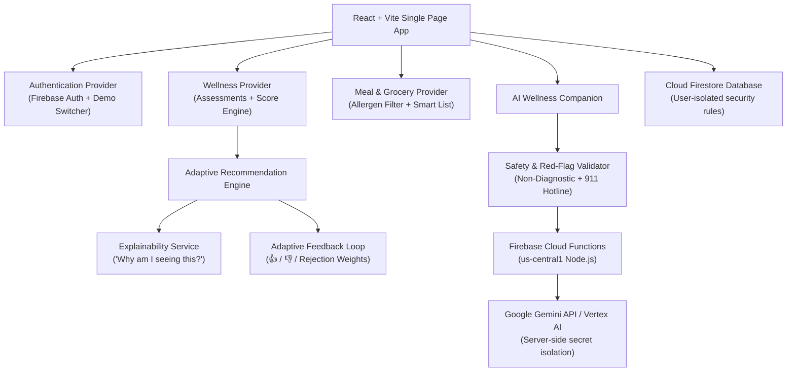

# IntelWell System Architecture

IntelWell is engineered as an AI-oriented, cloud-native wellness recommendation platform designed to deliver personalized, explainable, and adaptive lifestyle guidance.

---

## 1. Core Architectural Layers

### A. Frontend Layer (React 18 + Tailwind CSS)
* **Design Language**: Tailored emerald (`#059669`), teal, and slate palette with glassmorphism panels, accessible contrast ratios, and micro-animations.
* **Component Modularity**: High-level separation between presentation components (`components/common`), layout shells (`components/layout`), explainability overlays (`components/explainability`), and feature views (`features/*`).
* **Client-Side State Management**: Context-driven architecture (`AuthContext`, `WellnessContext`, `MealContext`, `NotificationContext`) avoiding bloated external state libraries while ensuring instant cross-page reactivity.

### B. Dual-Mode Storage & Auth Strategy
* **Production Cloud Mode**: When Firebase environment variables are configured in `.env`, the system provisions authenticated sessions via Firebase Auth and persists real-time telemetry to Cloud Firestore.
* **Local Evaluation Mode (Zero-Config Testing)**: When running without credentials, the system automatically falls back to an in-memory & local-storage sandboxed database pre-seeded with 3 realistic personas (Sarah, Alex, Morgan). This guarantees immediate testing without white screens or setup friction.

### C. Recommendation & Explainability Engine
* **Multi-Factor Heuristics**:
  $$\text{Relevance Score} = \text{BaseScore} \times W_{\text{category}} + \text{TriggerBonus} + \text{GoalAlignment} - \text{Penalty}_{\text{allergens}}$$
* **Explainability Guarantee**: Every recommendation computes an explainability manifest containing:
  1. Trigger factor (e.g., hydration deficit $< 70\%$ of target).
  2. Concrete biological or lifestyle rationale.
  3. Strict allergen verification and exclusions.
  4. Cumulative adaptation weight from past user feedback.

### D. Mobile-Ready Backend Architecture
The backend is completely decoupled from web DOM dependencies. The Firestore collection schemas (`healthProfiles`, `dailyAssessments`, `recommendations`, `groceryLists`) and Firebase Cloud Functions (`aiAssistant`, `generateWeeklySummary`, `sendAssistanceAlert`) are structured as RESTful/Callable JSON APIs, enabling a React Native or Flutter mobile application to plug directly into the same Firebase project without backend alterations.
